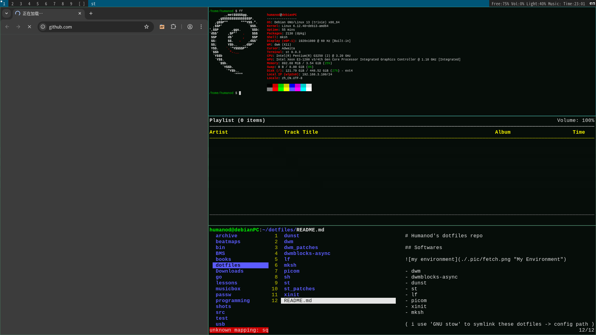

# Humanod's dotfiles repo

## Softwares

- dwm
- dwmblocks-async
- dunst
- st
- lf
- picom
- xinit
- mksh

( i use 'GNU stow' to symlink these dotfiles -> config path )

## .sh

**all my shell scripts are storaged at /sh**

most of these scripts are based on 'dmenu' & 'st' & 'libnotify'

bn_*.sh are based on 'brightnessctl'

vol_*.sh are based on 'wireplumber'

shotgun.sh is based on 'shotgun'

shotfree.sh is based on 'import' of 'imagemagick'

todo.sh is based on 'sent' of suckless

mpc_\*.sh & mpd_\*.sh are based on 'systemctl' & 'mpd' & 'mpc' & 'ncmpcpp'

